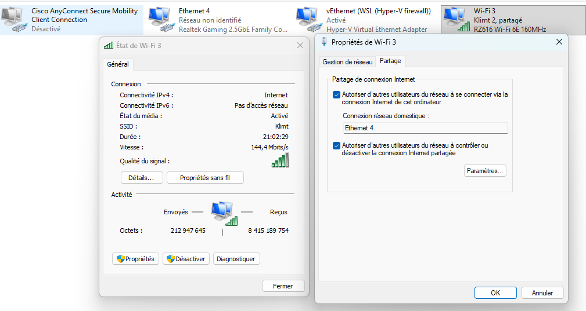

# Creating a HomeLab with K8s

## 1. Creating the bootable USB key to install Ubuntu Server (without GUI)
Ubuntu 24.02: https://ubuntu.com/download/server

## 2. Boot the PC (raspberry) and select the SSH server option

## 3. Share the Wi-Fi internet connection of the PC to the ethernet network (for the raspberry)

⚠️ The PC will automatically take IP 192.168.137.1.
Configure the switch and the raspberry on the same network before enabling sharing:

| device | IP adress | How | 
| ------ | --------- | --- |
| Switch | 192.168.137.2 | Access the web UI on 192.168.0.1 and change it |
| Raspberry | 192.168.137.3 | ip addr add 192.168.137.3/24 dev eth0 |

Then, On your windows computer: 
Go to:

Control Panel → Network and Internet → Network and Sharing Center → Change adapter settings
Then double-click the Wi-Fi network → Properties → Sharing tab.

Then share the wifi connection with the ethernet network. 



## 4. Configure and start the SSH server

If it’s not installed:
```sh
sudo apt install openssh-server
```

Check the SSH service status:
```sh
sudo systemctl status ssh
```

Edit the SSH configuration:
```sh
sudo vi /etc/ssh/sshd_config
```

Enable and start the SSH server:
```sh
sudo systemctl enable ssh
sudo systemctl start ssh
```

## 5. Connect to the raspberry from another PC via SSH 

Open a Linux terminal (or WSL) and enter: (if you use port 22, no need to specify it)
```sh
ssh -p <port> <user>@IP
```

For us, it will be like
```sh
ssh <user>@192.168.137.3
```

**You can now access the raspberry from your PC and you don't need to be on the raspberry for the next steps, just keep your terminal with ssh connections.**

## 6. Install and configure Git

Install Git:
```sh
sudo apt install git-all
```

[Create](https://docs.github.com/en/authentication/connecting-to-github-with-ssh/generating-a-new-ssh-key-and-adding-it-to-the-ssh-agent?platform=linux#adding-your-ssh-key-to-the-ssh-agent) an SSH key

[Add](https://docs.github.com/en/authentication/connecting-to-github-with-ssh/adding-a-new-ssh-key-to-your-github-account) the SSH key to GitHub

### Create a repository in the project directory:
```sh
git init -b main
```

```sh
Add files and commit:
git add . && git commit -m "init"
```

Create the repository on GitHub, copy the SSH URL and link it:
```sh
git remote add origin <url>
```

Push the project:
```sh
git push origin main
```

## 7. See all computers connected to the switch

From Linux or WSL:

Install nmap:
```sh
sudo apt install nmap
```

Find the network IPv4 and mask (example: 192.168.0.0/24)

Scan the network:
```sh
nmap -sn <network/mask>
```

Example:
```sh
nmap -sn 192.168.0.0/24
```


## 8. Install k3s (lightweight Kubernetes) and Helm

[Documentation](https://docs.k3s.io/quick-start)

```sh
curl -sfL https://get.k3s.io | sh -
sudo cp /etc/rancher/k3s/k3s.yaml ~/.kube/config
export KUBECONFIG=~/.kube/config
sudo apt-get update
sudo apt-get install helm
```

## 9. Install k9s

K9s is a great tool to see what happened on the k3s cluster but I didn't manage to use it on arm64 architecture (raspberry)

## 10. Install PostgreSQL and pgAdmin

```sh
helm repo add bitnami https://charts.bitnami.com/bitnami
helm install postgres bitnami/postgresql -f postgres/postgres-values.yml --version 18.1.10
helm repo add runix https://helm.runix.net
helm install pgadmin4 runix/pgadmin4 -f pgadmin/pgadmin-values.yml --version 1.50.0
```
