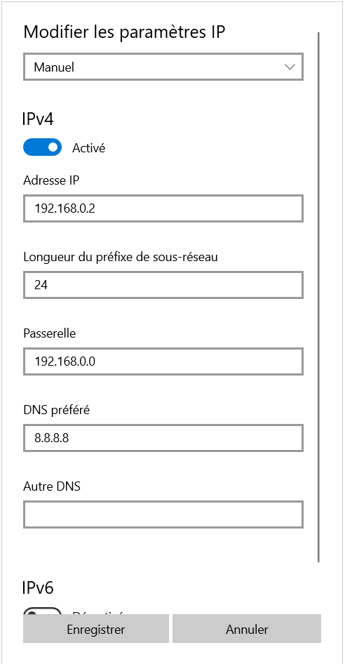

# Création d’un HomeLab avec K8s sur un vieux PC
## 1. Création de la clé USB bootable pour installer ubuntu server (sans GUI) : 
Ubuntu 24.02 : https://ubuntu.com/download/server

## 2. Booter le PC et sélectionner le serveur SSH en option 

## 3. Configurer le WIFI 
Connaitre le nom de la carte wifi : taper la commande « ip a » et regarder quelle carte commence par « wl »

Modifier le fichier (ou le créer) : 
/etc/netplan/01-network-manager-all.yaml
```yaml
network:
  ethernets:
    eth0:
      dhcp4: true
      optional: true
  version: 2
  wifis:
    wlp6s0: # nom de la carte wifi
      optional: true
      access-points:
        "<nom du wifi>": # nom du wifi
          password: "<mot de passe>" # mot de passe du wifi
      dhcp4: true
```

Puis taper : `sudo netplan apply`

Pour plus d'information, regarder ce [tuto](https://linuxconfig.org/ubuntu-20-04-connect-to-wifi-from-command-line)

## 4. Configurer et démarrer le serveur SSH 
S’il n’est pas installé : `sudo apt install openssh-server`

Connaitre l’état du server : `sudo systemctl status ssh`

Configurer le serveur : `sudo vi /etc/ssh/sshd_config`

Activer et démarrer le server : `sudo systemctl enable ssh`

`sudo systemctl start ssh`

## 5. Se connecter au pc depuis un autre PC en ssh 
Connaitre l’IP du PC : `ip a` et prendre l’IP du wifi si connecté en wifi. 

Ouvrir un terminal linux (ou wsl) puis taper : `ssh -p <port> <user>@IP` ou `ssh <user>@IP` si le port est celui par défaut et entrer le mot de passe de l’utilisateur. 

## 6. Configurer le PC portable pour fonctionner écran fermé 
Taper : `sudo vim /etc/systemd/logind.conf`
Modifier les 3 lignes suivantes : 
```yaml
HandleLidSwitch=ignore
HandleLidSwitchExternalPower=ignore	
HandleLidSwitchDocked=ignore 
```
Puis taper : `systemctl restart systemd-logind`

## 7. Installer et configurer git 
installer git : `sudo apt install git-all`

Se créer une clé ssh : https://docs.github.com/en/authentication/connecting-to-github-with-ssh/generating-a-new-ssh-key-and-adding-it-to-the-ssh-agent?platform=linux#adding-your-ssh-key-to-the-ssh-agent

Ajouter la clé ssh dans github : https://docs.github.com/en/authentication/connecting-to-github-with-ssh/adding-a-new-ssh-key-to-your-github-account

Créer un repository dans le projet (avec branche par défaut main) : `git init -b main`

Ajouter les fichiers puis commit : `git add . && git commit -m “init”`

Créer le repository sur Github puis copier l’url SSH et l’ajouter dans le repo : `git remote add origin <url>`

Push le projet sur git : `git push origin main`


## 8. Configurer l’adresse IP pour le switch

Le switch a pour adresse IP `192.168.0.1`.

### Sur windows
Aller dans les paramètres et configurer le réseau et l'adresse comme l'exemple ci dessous : 


### Sur linux : 

`ip a` -> vérifier qu’aucune adresse n’est configurée pour l’interface “eth0”

`ip link set eth0 up` -> activer l’interface ethernet

`ip addr add <adresse_IPv4/mask> dev eth0 `


## 9. Voir tous les ordinateurs connectés sur le switch 

Depuis linux ou WSL : 

Installer nmap : `sudo apt install nmap`

Trouver l’adresse IPv4 du réseau et le masque (pour nous 192.168.0.0/24)

taper : “nmap -sn <ip_reseau/masque>” qui devient “nmap -sn 192.168.0.0/24” 

## 10. Installer k3s (version légère de k8s) 
Taper `curl -sfL https://get.k3s.io | sh -`

Voir la doc ici : https://docs.k3s.io/quick-start

